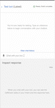

# AWS Lex Robo Advisor - UW Fintech Bootcamp Module 15 Challenge

This is my AWS Lex bot that uses an AWS Lambda to give investment portfolio recommendations based on user input details such as age, risk-level, and investment amount. 

## Using the Bot

Assuming that valid input has been provided to the bot, you will be able to receive recommended portfolio diversification percentages based on your personal details. 

In the [Videos](./Videos/) folder I have provided examples of running each [test event](./Test_Events/) in the chatbot dialog box, and have also included videos showing general valid/invalid usage of the bot.

**Test Events**
* [ageError](./Videos/age_error_test.mov)
* [correctDialog](./Videos/correct_dialog_test.mov)
* [incorrectAmountError](./Videos/incorrect_amount_error_test.mov)
* [negativeAgeError](./Videos/negative_age_error_test.mov)

**General Usage**
* [Valid input](./Videos/valid_input_test.mov)
* [Invalid input](./Videos/invalid_input_test.mov)

**Initial Test (Before Lambda Logic)**
* [Initial Test](./Videos/initial_roboadvisor_test.mov)

---

## Bot Configurations

The Lex bot has the following configurations: 

**General Criteria:**
* Bot name: RoboAdvisor
* Language: English (US)
* Output voice: Salli
* Session timeout: 5 minutes
* Sentiment analysis: No
* COPPA: No
* Advanced options: No
* All other options: The default value

**Intents:**
* recommendPortfolio
    * Utterances
        * I want to save money for my retirement
        * I'm {age} and I would like to invest for my retirement
        * I'm ​{age} and I want to invest for my retirement
        * I want the best option to invest for my retirement
        * I'm worried about my retirement
        * I want to invest for my retirement
        * I would like to invest for my retirement
    * Slots
        * firstName - AMAZON.US_FIRST_NAME - "Thank you for trusting me to help, could you please give me your name?"
        * age - AMAZON.NUMBER - "How old are you?"
        * investmentAmount - AMAZON.NUMBER - "How much do you want to invest?"
        * riskLevel - AMAZON.AlphaNumeric - "What level of investment risk would you like to take? (None, Low, Medium, High)"

---

## Technologies

This is an Amazon Lex chatbot that uses a Python 3.7 lambda function. 

The following dependencies are used: 
1. [AWS Lex](https://aws.amazon.com/lex/) (V1) - NLP chatbot 
2. [AWS Lambda](https://aws.amazon.com/lambda/) - Business logic extension to Lex bot

---

## Usage

The Jupyter notebook [machine_learning_trading_bot.ipynb](./machine_learning_trading_bot.ipynb) will provide all steps of the data collection, preparation, and analysis. Data visualizations are shown inline and accompanying analysis responses are provided.

---

## Contributors

[Ethan Silvas](https://github.com/ethansilvas)

---

## License

This project uses the [GNU General Public License](https://choosealicense.com/licenses/gpl-3.0/)